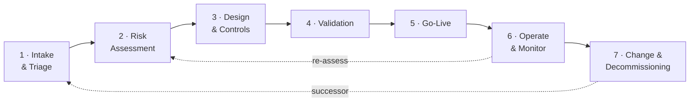

# agentic-ai-governance-toolkit

[](https://github.com/leonkoellerwirth-arch/agentic-ai-governance-toolkit/actions/workflows/ci.yml)
[](LICENSE)
[](LICENSE)
[](https://www.python.org/downloads/)
[](https://github.com/astral-sh/ruff)

**Practical governance artifacts for AI agents in regulated organizations — lifecycle models, risk
scoring, EU AI Act & DORA checklists, and a working evaluator.**

Governance frameworks stay abstract. Agents need operationalized controls. This repository puts the
tools on the table — the artifacts a team can pick up and use the same day.

> A reference pattern, not a framework. Distilled from practice in regulated environments. This is a
> practitioner's toolkit, **not legal advice** — see [`DISCLAIMER.md`](DISCLAIMER.md).

## The lifecycle at a glance

Every artifact here hangs off one spine: the agent lifecycle, governed across four responsibility
lanes (Business · AI team · Risk 2nd line · IT operations).



The [risk model](docs/02-risk-assessment/agent-risk-model.md) scores six dimensions into a control
level (C1–C4); that level then drives how much control every later phase must build.

## Quickstart

The [evaluator](evaluator/README.md) turns the rubric into a command you can run:

```bash
./setup.sh   # .venv + install + offline tests (Python 3.11+)
source .venv/bin/activate

# Score a use case → risk total, control level, and the controls it requires
agent-eval score --input evaluator/examples/usecase-03-payments-operations-agent.yaml
```

```text
Total 21 → control intensity C4 (Critical)
  • override: action_space → floor C4 (Acting on the outside world … is never light-touch)
Minimum controls
  - Per-action pre-authorization by an accountable human.
  - Continuous monitoring with real-time alerting and a tamper-evident audit trail.
  …
```

Then check an agent against a policy and analyze its audit trail:

```bash
agent-eval policy-check --input evaluator/examples/agent-for-policy-check.yaml \
                        --policy evaluator/policies/example-policy.yaml
agent-eval log-analyze  --input evaluator/examples/logs-sample.jsonl \
                        --policy evaluator/policies/example-policy.yaml
```

## What's inside

| Area | Artifact |
|------|----------|
| **Lifecycle** | [Seven-phase lifecycle](docs/01-agent-lifecycle/lifecycle-overview.md) with [Mermaid diagrams](docs/01-agent-lifecycle/diagrams/) (swimlanes, triage flow, escalation paths) |
| **Risk** | [Risk model](docs/02-risk-assessment/agent-risk-model.md) · [scoring rubric](docs/02-risk-assessment/scoring-rubric.md) · [worked examples](docs/02-risk-assessment/examples/) (C1, C3, C4-by-override) |
| **Checklists** | EU AI Act ([EN](docs/03-checklists/eu-ai-act-agent-checklist.en.md) · [DE](docs/03-checklists/eu-ai-act-agent-checklist.de.md)) · DORA ([EN](docs/03-checklists/dora-ict-risk-checklist.en.md) · [DE](docs/03-checklists/dora-ict-risk-checklist.de.md)) · [go-live readiness](docs/03-checklists/go-live-readiness.md) |
| **Operating model** | [Roles & RACI](docs/04-operating-model/roles-and-raci.md) · [decision rights](docs/04-operating-model/decision-rights.md) · [committee templates](docs/04-operating-model/committee-templates.md) |
| **Monitoring** | [KPI catalog](docs/05-monitoring/kpi-catalog.md) · [logging requirements](docs/05-monitoring/logging-requirements.md) |
| **Evaluator** | [Python tool](evaluator/README.md): risk scoring, policy checks, log analysis, optional LLM judge |
| **Templates** | [Use-case intake](templates/use-case-intake.md) · [agent registry entry](templates/agent-registry-entry.md) · [decommissioning protocol](templates/decommissioning-protocol.md) |

**One rubric, one source of truth.** The scoring rubric lives once, in
[`rubric.yaml`](evaluator/src/agent_evaluator/rubric.yaml). The evaluator scores against it, the
[documentation tables](docs/02-risk-assessment/scoring-rubric.md) are rendered from it, and a test
fails if the two ever drift.

## Known limitations

This is the first public release (v0.1.0). What it deliberately does **not** do:

- **It is not legal advice and not a compliance certification.** Regulatory references (EU AI Act,
  DORA) are indicative pointers marked "verify"; whether and how an obligation applies depends on
  your classification, role, and jurisdiction. See [`DISCLAIMER.md`](DISCLAIMER.md).
- **The rubric is a starting point, not a calibrated standard.** Dimensions are equally weighted and
  the thresholds are illustrative — adapt them to your own risk appetite.
- **The evaluator is a reference pattern, not a product.** No persistence, no API, no auth, no UI —
  it is a readable CLI and library meant to be understood and adapted, not deployed as-is.
- **The `llm_judge` is a demonstration.** It shows the LLM-as-judge control; it is not evaluated,
  calibrated, or hardened for production, and the core evaluator never depends on it.
- **Checklists are not exhaustive.** They cover the agent-relevant themes, not every obligation.
- **All examples are fictional.** No real organizational data or customer detail appears anywhere.

Feedback and issues are welcome.

## License

Dual-licensed: source code under the **MIT License**, documentation and artifacts under
**CC BY 4.0**. See [`LICENSE`](LICENSE) and [`DISCLAIMER.md`](DISCLAIMER.md).

## Who is behind this

**Leon Köllerwirth Hlihel** — Interim IT leader & principal consultant for AI governance and agentic
AI operating models, enterprise architecture in regulated environments (BaFin/DORA).
Website: [leonkoellerwirth.de](https://leonkoellerwirth.de).
