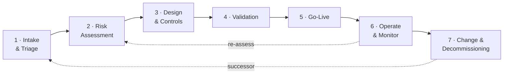

# agentic-ai-governance-toolkit

[](https://github.com/leonkoellerwirth-arch/agentic-ai-governance-toolkit/actions/workflows/ci.yml)
[](LICENSE)
[](LICENSE-docs)
[](https://www.python.org/downloads/)
[](https://github.com/astral-sh/ruff)

**Practical governance artifacts for AI agents in regulated organizations — lifecycle models, risk
scoring, EU AI Act & DORA checklists, and a working evaluator.**

Governance frameworks stay abstract. Agents need operationalized controls. This repository puts the
tools on the table — the artifacts a team can pick up and use the same day.

> A reference pattern, not a framework. Distilled from practice in regulated environments. This is a
> practitioner's toolkit, **not legal advice** — see [`DISCLAIMER.md`](DISCLAIMER.md).

## The lifecycle at a glance

Every artifact here hangs off one spine: the agent lifecycle, governed across four responsibility
lanes (Business · AI team · Risk 2nd line · IT operations).


```mermaid
flowchart LR
    P1["1 · Intake<br/>& Triage"] --> P2["2 · Risk<br/>Assessment"]
    P2 --> P3["3 · Design<br/>& Controls"]
    P3 --> P4["4 · Validation"]
    P4 --> P5["5 · Go-Live"]
    P5 --> P6["6 · Operate<br/>& Monitor"]
    P6 --> P7["7 · Change &<br/>Decommissioning"]
    P6 -.->|"re-assess"| P2
    P7 -.->|"successor"| P1
```

The [risk model](docs/02-risk-assessment/agent-risk-model.md) scores six dimensions into a control
level (C1–C4); that level then drives how much control every later phase must build.

## Quickstart

The [evaluator](evaluator/README.md) turns the rubric into a command you can run:

```bash
./setup.sh   # .venv + install + offline tests (Python 3.11+)
source .venv/bin/activate

# Score a use case → risk total, control level, and the controls it requires
agent-eval score --input evaluator/examples/usecase-03-payments-operations-agent.yaml
```

```text
Total 21 → control intensity C4 (Critical)
  • override: action_space → floor C4 (Acting on the outside world … is never light-touch)
Minimum controls
  - Per-action pre-authorization by an accountable human.
  - Continuous monitoring with real-time alerting and a tamper-evident audit trail.
  …
```

Then check an agent against a policy and analyze its audit trail:

```bash
agent-eval policy-check --input evaluator/examples/agent-for-policy-check.yaml \
                        --policy evaluator/policies/example-policy.yaml
agent-eval log-analyze  --input evaluator/examples/logs-sample.jsonl \
                        --policy evaluator/policies/example-policy.yaml
```

## In your CI: the gate

The three commands above already exit non-zero on a finding. That makes them a gate — what was
missing was the wiring. A repository that runs agents can reference this one directly:

```yaml
# .github/workflows/governance.yml
name: Governance
on: [pull_request]
permissions:
  contents: read
jobs:
  gate:
    runs-on: ubuntu-latest
    steps:
      - uses: actions/checkout@v5
      - uses: leonkoellerwirth-arch/agentic-ai-governance-toolkit@v0.2.0
        with:
          readiness: governance/org-readiness.yaml
          assessment: governance/agent.yaml
          logs: artifacts/audit-trail.jsonl
          policy: governance/policy.yaml
```

Pin a tag, never a branch — the same zero-trust rule this repo applies to third-party actions
applies to this one. `v0.2.0` is the first release that carries `action.yml`.

Nothing is installed on your side and the rubric is not copied — it travels with the action, at
the version you pinned. Set only the inputs you have; each check is skipped when its input is
empty, and at least one is required.

**The run is the evidence.** Every check writes machine-readable JSON to `governance-evidence/`
(uploaded as a build artifact) and a readable block to the job summary, both stamped with the
evaluator version, the commit under test and the run id. A reviewer reads the summary; an
auditor reads the JSON; neither has to trust a screenshot.

`fail-on-findings: "false"` reports without blocking. That is a reasonable way to start on a
repository that has never been gated — and it should carry a date by which it flips back, because
a gate that never blocks is a green check that means nothing.

The `logs` input takes the JSONL audit trail written by
[`local-agent-pipeline`](https://github.com/leonkoellerwirth-arch/local-agent-pipeline); its event
schema is a documented integration contract with this evaluator.

## What's inside

| Area | Artifact |
|------|----------|
| **Scope** | [What this maps, and what it does not](docs/00-scope/regulatory-scope.md) — read before the checklists |
| **Lifecycle** | [Seven-phase lifecycle](docs/01-agent-lifecycle/lifecycle-overview.md) with [Mermaid diagrams](docs/01-agent-lifecycle/diagrams/) (swimlanes, triage flow, escalation paths) |
| **Risk** | [Risk model](docs/02-risk-assessment/agent-risk-model.md) · [scoring rubric](docs/02-risk-assessment/scoring-rubric.md) · [policy decisions](docs/02-risk-assessment/policy-decisions.md) · [worked examples](docs/02-risk-assessment/examples/) (C1, C3, C4-by-override) |
| **Checklists** | EU AI Act ([EN](docs/03-checklists/eu-ai-act-agent-checklist.en.md) · [DE](docs/03-checklists/eu-ai-act-agent-checklist.de.md)) · DORA ([EN](docs/03-checklists/dora-ict-risk-checklist.en.md) · [DE](docs/03-checklists/dora-ict-risk-checklist.de.md)) · [go-live readiness](docs/03-checklists/go-live-readiness.md) · [regulatory sources](docs/03-checklists/regulatory-sources.md) |
| **Operating model** | [Roles & RACI](docs/04-operating-model/roles-and-raci.md) · [decision rights](docs/04-operating-model/decision-rights.md) · [committee templates](docs/04-operating-model/committee-templates.md) · [provider dependency](docs/04-operating-model/provider-dependency.md) |
| **Monitoring** | [KPI catalog](docs/05-monitoring/kpi-catalog.md) · [logging requirements](docs/05-monitoring/logging-requirements.md) · [incident response](docs/05-monitoring/incident-response.md) |
| **Readiness** | [Agent readiness rubric](docs/06-readiness/agent-readiness-rubric.md) — whether the organization can carry the exposure it runs |
| **Evaluator** | [Python tool](evaluator/README.md): risk scoring, readiness assessment, policy checks, log analysis, optional LLM judge |
| **Templates** | [Use-case intake](templates/use-case-intake.md) · [agent registry entry](templates/agent-registry-entry.md) · [decommissioning protocol](templates/decommissioning-protocol.md) |

**One rubric, one source of truth.** The scoring rubric lives once, in
[`rubric.yaml`](evaluator/src/agent_evaluator/rubric.yaml). The evaluator scores against it, the
[documentation tables](docs/02-risk-assessment/scoring-rubric.md) are rendered from it, and a test
fails if the two ever drift. The same holds for
[`readiness.yaml`](evaluator/src/agent_evaluator/readiness.yaml), the second rubric.

**Two questions, two rubrics.** `rubric.yaml` asks how much control *an agent* needs — its exposure.
`readiness.yaml` asks whether the *organization* running it has that control. Readiness is never
absolute: it is measured against the control level actually in production, so an organization running
only C1 agents can be ready while one running C4 agents with C2 controls is not.

## Known limitations

What this deliberately does **not** do:

- **It is not legal advice and not a compliance certification.** Regulatory references (EU AI Act,
  DORA) are indicative pointers marked "verify"; whether and how an obligation applies depends on
  your classification, role, and jurisdiction. What is mapped, what deliberately is not, and why the
  three repositories answer that differently:
  [what this maps, and what it does not](docs/00-scope/regulatory-scope.md). See also
  [`DISCLAIMER.md`](DISCLAIMER.md).
- **The rubric is a starting point, not a calibrated standard.** Dimensions are equally weighted and
  the thresholds are illustrative — adapt them to your own risk appetite. Which numbers are
  judgement, and what each one gets wrong on purpose, is recorded in
  [policy decisions](docs/02-risk-assessment/policy-decisions.md).
- **The evaluator proves provenance, not truth.** A deterministic evaluator shows that a result
  followed reproducibly from the rules. It does not show that the rules are right — that C1–C4 are
  calibrated, that R2 is the correct minimum, that the dimensions are complete, or that the
  aggregation is valid. Those are arguments, and they are written down to be argued with.
- **Readiness is self-assessed, and self-assessment overstates.** The readiness rubric asks for
  evidence a reviewer could demand and be refused; nothing checks that the evidence exists.
  `traceability` is the dimension it most reliably overstates, and the result says so when the claim
  is high. Exposure follows the single riskiest agent, so retiring that one agent lowers the reported
  figure without any control improving — the result names that path too.
- **The evaluator is a reference pattern, not a product.** No persistence, no API, no auth, no UI —
  it is a readable CLI and library meant to be understood and adapted, not deployed as-is.
- **The `llm_judge` is a demonstration.** It shows the LLM-as-judge control; it is not evaluated,
  calibrated, or hardened for production, and the core evaluator never depends on it.
- **Checklists are not exhaustive.** They cover the agent-relevant themes, not every obligation.
- **All examples are fictional.** No real organizational data or customer detail appears anywhere.

Feedback and issues are welcome.

## License

Dual-licensed: source code (`evaluator/`, `scripts/`) under the [MIT License](LICENSE);
documentation and artifacts (`docs/`, `templates/`, the checklists and the risk model) under
[CC BY 4.0](LICENSE-docs). If it runs, it is MIT; if it is read, it is CC BY 4.0. See also
[`DISCLAIMER.md`](DISCLAIMER.md).

## Who is behind this

**Leon Köllerwirth Hlihel** — Interim IT leader & principal consultant for AI governance and agentic
AI operating models, enterprise architecture in regulated environments (BaFin/DORA).
[leon-koellerwirth.com](https://leon-koellerwirth.com) ·
[LinkedIn](https://www.linkedin.com/in/leon-k%C3%B6llerwirth-642506197/) ·
Sister repository: [rag-approval-blueprint](https://github.com/leonkoellerwirth-arch/rag-approval-blueprint)
— the approval file and control set for getting a RAG assistant live in a regulated organization.
