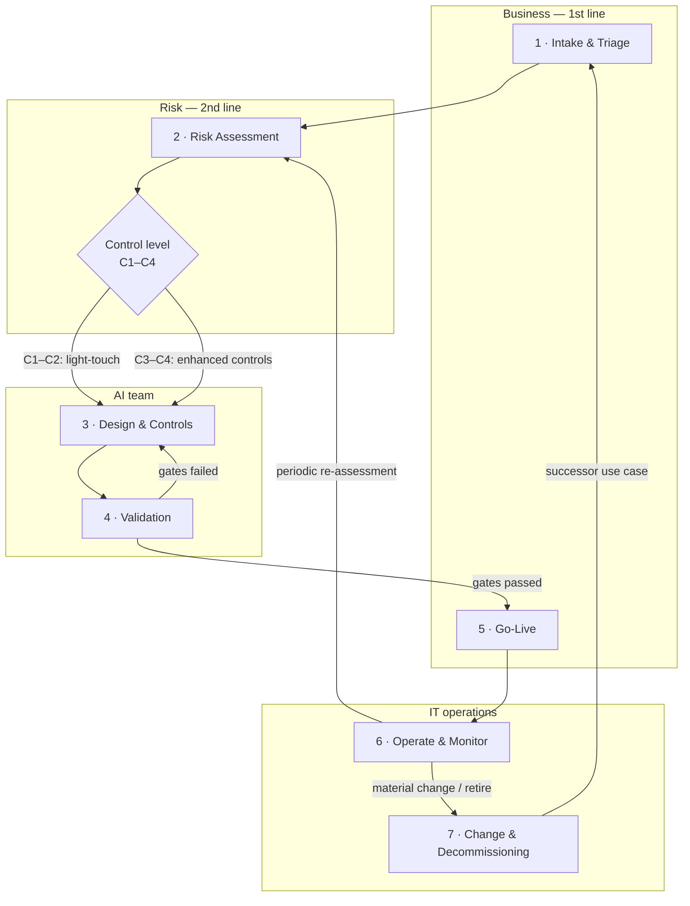
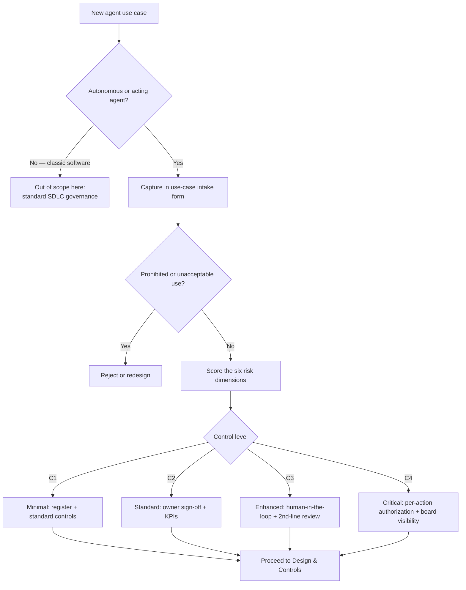
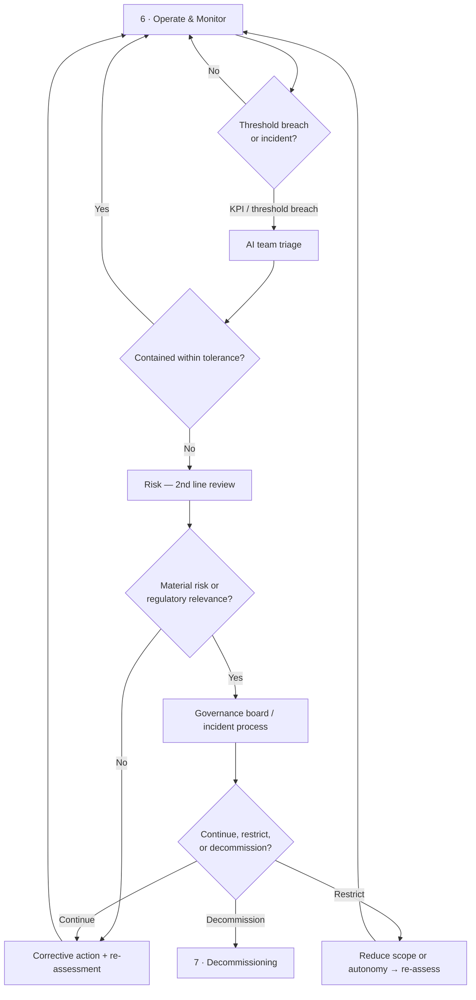

# Agent lifecycle — seven phases

An AI agent is governed across its whole life, not just at go-live. This lifecycle breaks that into
seven phases. Each has a **goal**, a clear **input and output**, a **responsible role**, and a
**control point** — the gate that must be satisfied before the agent moves on.

> This is a practitioner's toolkit, not legal advice. Adapt the phases and gates to your own
> control framework and regulatory obligations.

The four responsibility lanes are the usual three lines of defense plus IT operations:
**Business (1st line)** owns the use case and its risk, **AI team** builds and runs the agent,
**Risk (2nd line)** independently assesses and reviews, **IT operations** runs and retires it.

## At a glance

| # | Phase | Goal | Responsible | Control point |
|:-:|-------|------|-------------|---------------|
| 1 | Intake & Triage | Capture the use case and decide if it proceeds | Business (1st line), AI team | Triage decision recorded; prohibited uses filtered out |
| 2 | Risk Assessment | Score risk, set the control-intensity level | Risk (2nd line) | Control level C1–C4 assigned and signed off |
| 3 | Design & Controls | Build in the controls the level demands | AI team | Control design reviewed against the level's minimums |
| 4 | Validation | Prove the agent and its controls work | AI team, Risk (2nd line) | Acceptance gates passed; red-teaming light done |
| 5 | Go-Live | Release under an accountable owner | Business (1st line) | Registry entry complete; go-live gate signed |
| 6 | Operate & Monitor | Run within tolerance; catch drift | IT operations, AI team | KPIs and log reviews within threshold; re-assessment due dates kept |
| 7 | Change & Decommissioning | Change safely; retire in order | IT operations, Risk (2nd line) | Change class assessed; decommissioning protocol completed |

## The phases in detail

### 1 · Intake & Triage

- **Goal:** turn a request into a described use case and decide whether it belongs in the agent
  programme at all — and filter out prohibited or unacceptable uses early.
- **Input:** a business need. **Output:** a completed [use-case intake](../../templates/use-case-intake.md)
  and a triage decision (proceed / redesign / reject).
- **Responsible:** Business (1st line), supported by the AI team.
- **Control point:** the triage decision is recorded; anything prohibited or clearly unacceptable
  stops here. See the [triage flow](#triage-flow).

### 2 · Risk Assessment

- **Goal:** score the use case on the six [risk dimensions](../02-risk-assessment/agent-risk-model.md)
  and assign a control-intensity level (C1–C4).
- **Input:** the intake form. **Output:** a scored assessment and an assigned level with its minimum
  controls.
- **Responsible:** Risk (2nd line), who own the model and the sign-off.
- **Control point:** the level is assigned and signed off. The level, not a gut feeling, drives how
  much control the following phases must build.

### 3 · Design & Controls

- **Goal:** design the agent so the level's minimum controls are built in — guardrails, the
  action-space limit, the human-in-the-loop points, the audit trail.
- **Input:** the assigned level and its controls. **Output:** an architecture and control design.
- **Responsible:** AI team.
- **Control point:** the control design is reviewed against the level's minimum controls; gaps are
  closed before validation. For C3+ this review is independent (2nd line).

### 4 · Validation

- **Goal:** show that the agent does what it should and that its controls actually fire.
- **Input:** the built agent and its control design. **Output:** validation evidence and an
  acceptance decision.
- **Responsible:** AI team, with Risk (2nd line) for higher levels.
- **Control point:** acceptance gates are passed, including a light red-teaming pass (try to make
  the agent act outside its action space, leak data, or skip the human gate). Failures return to
  Design & Controls.

### 5 · Go-Live

- **Goal:** release the agent under a named accountable owner, on the record.
- **Input:** validation evidence. **Output:** a live agent and a completed
  [registry entry](../../templates/agent-registry-entry.md).
- **Responsible:** Business (1st line) owner, with the sign-offs the level requires.
- **Control point:** the [go-live readiness](../03-checklists/go-live-readiness.md) gate is signed;
  the agent is in the registry with its owner, level, and controls; any transparency/communication
  duties are met.

### 6 · Operate & Monitor

- **Goal:** keep the agent inside its risk tolerance and catch drift before it becomes an incident.
- **Input:** the live agent. **Output:** monitoring evidence, incidents, and re-assessment triggers.
- **Responsible:** IT operations, with the AI team.
- **Control point:** the [KPIs](../05-monitoring/kpi-catalog.md) and log reviews stay within
  threshold, and scheduled re-assessments happen on time. Breaches follow the
  [escalation paths](#escalation-paths).

### 7 · Change & Decommissioning

- **Goal:** make changes without silently changing the risk, and retire the agent in an orderly way.
- **Input:** a change request or a retirement trigger. **Output:** a re-assessed change, or a
  completed [decommissioning protocol](../../templates/decommissioning-protocol.md).
- **Responsible:** IT operations, with Risk (2nd line).
- **Control point:** the change is classified — a change to autonomy, action space, data, or model
  re-opens Risk Assessment; decommissioning follows the protocol (access revoked, audit trail
  retained, dependencies handled).

## Triage flow

How Intake & Triage reaches a decision and a control level:

## Escalation paths

What monitoring does when a threshold is breached or an incident occurs:

The blocks above render natively on GitHub. The [`diagrams/`](diagrams/) folder holds the Mermaid
sources (`.mmd`, the source of truth) and pre-rendered `.svg` versions
([lifecycle](diagrams/lifecycle-bpmn.svg) · [triage](diagrams/triage-flow.svg) ·
[escalation](diagrams/escalation-paths.svg)) for use outside GitHub; regenerate them with
`./scripts/render-diagrams.sh`.
