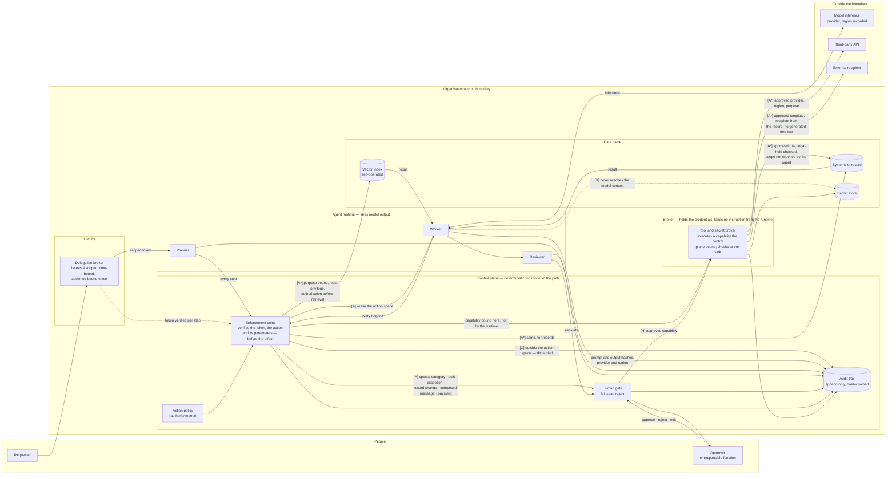

# Reference architecture

Where the model sits, where the boundary is, and where the evidence comes from. One picture for
the questions an architect asks before reading any control catalogue, and a table underneath
because a diagram alone answers none of them precisely.

The authority markers match the [action authority matrix](../03-checklists/action-authority-matrix.md):
**[A]** automatic, **[A\*]** automatic while its preconditions hold, **[H]** human approval,
**[X]** refused by design.

Illustrative reference architecture, not a deployed system. Not legal advice — see
[`DISCLAIMER.md`](../../DISCLAIMER.md).

[Source](diagrams/agent-reference-architecture.mmd) · [SVG](diagrams/agent-reference-architecture.svg)

## The questions, answered

| Question | Answer in this architecture |
|---|---|
| Where does the model sit? | Outside the boundary, at a provider whose region is recorded per call. Nothing here assumes it is trustworthy, and the provider writes to its own logs, not to this trail. |
| Where does retrieval sit? | Inside. Index and embeddings are self-operated, which is what makes a deletion proof possible at all. |
| Where do tools sit? | Behind a broker that holds the credentials and takes no instruction from the runtime. The capability it executes is bound by the control plane, not composed by the worker; the broker checks again at the sink. |
| Which identity is used? | A scoped, time-bound, audience-bound delegation token, issued before any step runs and **verified at the enforcement point on every request**. Retrieval does not establish identity, and an earlier version that implied it did was wrong. |
| Which systems may be read? | The index and systems of record — and only through the enforcement point, which is what "authorisation before retrieval" means here. Special-category data, bulk access and exceptional purposes go to the gate instead. |
| Which systems may be written? | Systems of record, through the broker. Two paths run unattended under preconditions the diagram names: an approved deletion rule with its legal-hold check and no agent-widened scope, and revocation on a source event. |
| What needs human approval? | Ad-hoc record changes, composed external messages, payments, publication, granting access, bulk export, changes to production logic, and decisions on an individual case — plus anything the reviewer escalates. |
| What is refused outright? | Reading credentials, keys or secrets; changing the agent's own scope; disabling oversight. The broker reaches the secret store; the runtime never does. |
| What may happen automatically? | Retrieval inside the action space, drafting, calls inside an already-approved flow, and pre-approved templated notifications where the recipient comes from the record and no free text is generated. |
| Which data is processed outside? | Whatever the prompt carries to the provider, plus whatever an approved third-party call transmits — both logged with data categories and region. |
| Where do logs arise? | Planner, worker, reviewer, gate, enforcement point and broker each write to one append-only, hash-chained trail. Hashes bind content already known; they do not prove the access was authorised or that no event was omitted. |

## The two boundaries that matter

**The organisational boundary** is the outer box. Data crossing it is a transfer, and the
architecture is arranged so that crossings are few, named and logged with their region. The model
is on the far side of it, which is the single most consequential fact in the picture.

**The control-plane boundary** is the inner one, and it is the less obvious of the two. Policy,
the enforcement point, the gate and the trail sit outside the agent's reach — no model in the
path, nothing the agent can widen from inside. Every data and tool access crosses it, which is the
only reason the labels on those arrows mean anything: an earlier version wrote guarantees onto the
brokers and then drew paths around them, which claimed enforcement it did not show. This is why refusing to *disable oversight* is a
meaningful row rather than a wish: if the control plane were inside the runtime, an agent that
could stop logging could also suppress the record of having stopped it.

## What this diagram does not show

- **It is a reference, not a deployment.** No real system is drawn here, and a real one will differ
  in the places that matter most to it.
- **It shows one agent.** Delegation appears in the matrix as a row and not in the picture; a
  multi-agent topology, where inherited scope is the whole question, needs its own diagram.
- **Arrows are permissions, not guarantees.** The picture shows where a check *is placed*, not that
  it is effective. A pre-action check drawn in the right place and implemented in the wrong one
  looks identical here.
- **Hashes are not proof of the act.** They bind content already known to whoever holds it. They do
  not establish that an access was authorised, that a decision was competent, or that no event was
  left out. The trail's value is that tampering with what *was* recorded is detectable — not that
  the record is complete.
- **No failure paths.** Timeouts, partial writes, retries and compensating actions are where real
  incidents live, and none of them are drawn.

## Open questions

- The trail is drawn as one store. In practice, planner, gate and provider calls often land in
  different systems with different retention, and reconciling them is work the picture hides.
- Nothing here shows *when* the architecture is re-examined. An architecture diagram without a
  review trigger becomes a description of the past, and the trigger belongs in the operating model
  rather than in the drawing.
